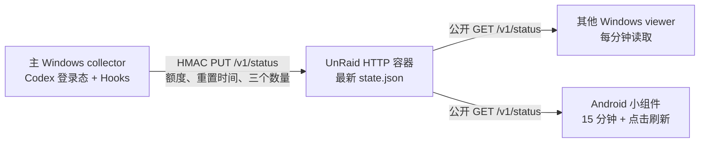

# Codex Quota Sync

Codex Quota Sync 是一个本地优先的跨设备 Codex 状态组件。主 Windows 电脑直接复用现有 Codex 登录态读取额度，不要求再次登录；UnRaid 上的轻量 HTTP 容器只保存最新一份 JSON；其他 Windows 电脑和 Android 桌面小组件只读显示同步结果。

## 已实现功能

- Windows collector：保留 Quota Float 的悬浮球、展开卡片、置顶、拖动、托盘和开机启动能力，直接读取本机 Codex 登录态。
- Windows viewer：不需要 Codex 登录，通过 `GET /v1/status` 每分钟读取服务器快照。
- Windows 设置页：collector 与 viewer 均可在界面中配置 HTTP 服务器地址/端口、设备标识、Hooks 状态文件和本机关机脚本；collector 还可通过仅写、不回显的字段保存或替换写入密钥，留空则保留原密钥。
- 完成后关机：collector 可一次性武装，在可信 Hooks 数据确认“执行中”从大于 0 变为 0 后运行本机 `.cmd`/`.bat` 脚本；重启或过期/不可用的 Hooks 数据不会触发，服务器离线时仍会执行已确认完成的本机脚本。
- Android 小组件：提供 1×1、4×1、4×3 三种尺寸，WorkManager 每 15 分钟自动更新，支持点击立即刷新和离线缓存。
- 额度信息：5 小时剩余、每周剩余、两个窗口的重置时间、最近将重置的窗口和时间、重置机会。
- 活动信息：显示“执行中”和“待处理”；待处理是待审批与待用户输入之和，协议仍分别同步两个原始数量。
- UnRaid 服务：单 Go 进程、单 `state.json`、无数据库、HTTP、自定义端口、HMAC 写入鉴权。
- 断网处理：同步“最近采集是否成功”和“最后有效额度”两个概念；远端离线时继续显示缓存并明确标为过期或离线。

## 架构



Codex access token、account ID、提示词、回复和原始用量响应不会上传。完整边界和失败语义见 [架构与协议](docs/架构与协议.md)。

## 快速开始

1. 按 [UnRaid 部署说明](docs/UnRaid部署说明.md) 构建并启动服务端。
2. 在主 Windows 安装桌面程序，配置为 `collector`，再安装 Codex Hooks。
3. 在其他 Windows 配置为 `viewer`。
4. 构建或安装 Android 调试 APK，把小组件放到桌面并填写同一 HTTP 地址。

Windows 的构建、collector/viewer 配置和 Hooks 安装命令见 [Windows 使用说明](docs/Windows使用说明.md)。Android 说明见 [android/README.md](android/README.md)。

## 更新频率

| 组件 | 行为 |
| --- | --- |
| 主 Windows 用量采集 | 常规最多每 5 分钟请求 Codex；距离下一次重置 15 分钟内改为每分钟 |
| 主 Windows 活动同步 | 每分钟读取本地 Hooks 聚合并上传；手动刷新立即执行 |
| Windows viewer | 每分钟读取服务器；手动刷新立即执行 |
| Android 小组件 | WorkManager 每 15 分钟，系统 AppWidget 每 30 分钟提供备用触发；点击刷新立即执行 |

## 目录

- `apps/desktop`：Tauri 2 + React Windows 悬浮组件，兼具 collector/viewer 角色。
- `server`：UnRaid 使用的 Go HTTP 服务、Dockerfile、Compose 和 UnRaid XML 模板。
- `android`：原生 Kotlin RemoteViews AppWidget。
- `schema/status-v1.schema.json`：跨端 JSON 契约。
- `docs`：中文架构、部署和使用文档。

## 开发验证

日常代码更新后，在仓库根目录双击 `update-build-all.cmd` 即可完成 Windows 测试与 Release 打包、Windows viewer ZIP、Android Debug APK、Collector 重启。脚本复用现有 Collector 配置，不会重写密钥，默认也不会重新安装或信任 Hooks。PowerShell 中可直接执行：

```powershell
.\update-build-all.ps1
```

产物汇总在 Windows 的 `target\release` 目录和仓库根目录的 `dist`。首次安装 Hooks 或 EXE 绝对路径变化时，才需要额外传入 `-InstallHooks`。需要脚本先安全拉取远端代码时可传入 `-UpdateSource`；工作区存在未提交改动时会中止，不会自动 stash 或 reset。

手动执行各项目验证时使用：

```powershell
# Windows 前端
Set-Location .\apps\desktop
npm install
npm test
npm run build

# Windows Rust 后端
Set-Location .\src-tauri
cargo fmt --all -- --check
cargo test --all-targets

# Android
Set-Location ..\..\..\android
.\gradlew.bat :app:testDebugUnitTest :app:assembleDebug

# Go 服务端
Set-Location ..\server
go test ./...
go vet ./...
```

## 许可证与来源

项目采用 MIT License。Windows 悬浮组件基于 [change-42-yhmm/quota-float](https://github.com/change-42-yhmm/quota-float) `v0.1.5` 改造，保留原作者版权声明；跨设备同步、活动 Hooks、Go 服务和 Android 小组件为本项目新增实现。详见 [第三方软件声明](THIRD_PARTY_NOTICES.md)。
