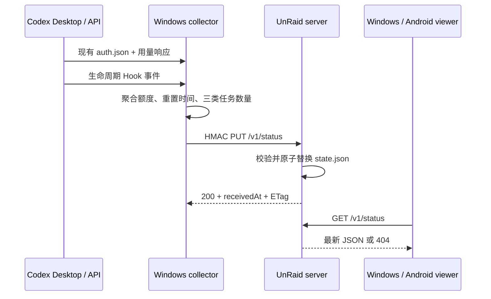

# Codex Quota Sync 架构与协议

## 1. 目标与角色

系统只同步一个 Codex 账号的“最新状态”，不保存历史趋势，不需要数据库。

- `collector`：固定在主 Windows 电脑。直接读取本机 Codex 登录文件并请求官方用量接口；读取官方 Hooks 生成的活动聚合；向服务器写入。
- `viewer`：其他 Windows 电脑。完全不读取 Codex 登录信息，只从服务器读取。
- `server`：UnRaid 上的无状态 HTTP API 加一份持久化 `state.json`。
- `Android widget`：只读服务器，不持有写密钥。



## 2. 无需重新登录的实现

桌面 collector 延续 Quota Float `v0.1.5` 的实现：只在本机读取 Codex 已保存的登录状态，构造 ChatGPT/Codex 用量请求。token 只存在于 collector 进程内存和请求官方接口的连接中，不写入 Codex Quota Sync 配置，也不进入同步 JSON。

viewer 不尝试复制 token，不要求安装或登录 Codex。因此主电脑以外的 Windows 和 Android 设备只有服务器 URL，不承担账号凭据风险。

## 3. 采集和刷新时序

桌面 UI 每分钟向 Rust 后端请求一次状态。后端将“同步活动”和“请求 Codex 用量”拆开：

- 普通情况下，用量响应缓存 5 分钟；每分钟仍重新读取活动文件并向服务器上传一次。
- 下一次重置时间进入未来 15 分钟以内后，用量缓存缩短为 1 分钟；重置后 5 分钟内也保持快速检查。
- 卡片或托盘的“立即刷新”会绕过用量缓存；窗口重新获得焦点和悬浮卡片展开会触发一次遵守缓存的刷新。
- Windows viewer 每分钟 GET；远端 `collectedAt` 超过 15 分钟后标记为过期。
- Android 使用 WorkManager 的系统最短周期 15 分钟，临时网络失败从 1 分钟开始指数退避；AppWidget 每 30 分钟提供备用触发。超过 45 分钟或服务端 `activity.stale=true` 时标记过期。Doze 和厂商后台策略仍可能延迟执行。
- Android 在每次成功请求后原子保留前后两份状态用于比较：执行中减少表示任务完成，合并后的待处理增加表示需要用户操作，两者触发一条系统通知。失败请求不更新比较基线，也不发送断联通知。

## 4. 活动数量语义

同步字段分为：

- `executing`：已提交、尚未结束，且当前未停在已知用户交互点的顶层 turn。
- `waitingOnApproval`：收到 `PermissionRequest`、正在等用户批准。
- `waitingOnUserInput`：收到 `PreToolUse(request_user_input)`、正在等用户回答。

本地只保存 session/turn ID 的 SHA-256、粗粒度状态、时间和宿主 PID/启动时间。同一 session 的新 turn 会替换旧 turn；`Stop` 删除 turn；SessionStart 和 PID 检查清理异常残留。无后续事件的 `executing` 最长保留 5 分钟，等待审批/输入仍保留 7 天。若 Hooks 从未成功写入状态文件，活动来源明确显示为 unavailable，不会把未知状态伪装成可信的 0。

这是官方 Hooks 能力上的 best-effort 统计。当前官方文档不保证内置 `request_user_input` 一定产生 Pre/PostToolUse，因此“待输入”在部分 Codex 版本可能继续显示在“执行中”。它也不包含 subagent、CLI、云任务或排队 follow-up。详细事件表见 [活动 Hooks 文档](../apps/desktop/docs/ACTIVITY-HOOKS.zh-CN.md)。

传输协议继续保留 `waitingOnApproval` 与 `waitingOnUserInput` 两个字段，方便诊断；Windows 与 Android 展示层把两者相加为“待处理”。界面状态底色优先级为：待处理黄色、执行中绿色、空闲灰色。

Android 通知只比较同一 `sourceId` 下 revision 递增、前后均来自 Hooks 且未过期的相邻成功状态。首次成功、重复或回退 revision、切换来源、`activity.source=unavailable`、`activity.stale=true` 以及网络/解析失败均不提醒。Android 13 及以上需要用户授予通知权限；厂商系统可能延迟 WorkManager，因此提醒发生在客户端实际取得新状态之后。

Windows collector 的“完成后关机”是完全本地的一次性动作：用户显式武装后，只有同一运行期可信 Hooks 快照已观察到 `executing > 0`、随后读取到 `executing = 0` 才会触发。它会按同步配置先尝试上传最终快照，再运行本地配置的绝对 `.cmd`/`.bat` 路径；上传失败或服务器离线不阻止本机脚本。武装状态不写入配置、不随重启恢复；程序重启、保存为 viewer，或保存时变更角色、Hooks 状态文件、关机脚本都会关闭该开关。过期或 `unavailable` 活动不会触发，并会清除旧的执行中基线，待恢复后重新观察。该开关和脚本路径都不会进入同步 JSON。

## 5. 状态协议

正式契约为 [`schema/status-v1.schema.json`](../schema/status-v1.schema.json)。顶层结构：

`windowSeconds` 字段必须存在，但上游未提供窗口长度时允许为 `null`；Windows viewer、Go 服务端和 Android 都按同一规则解析。

```json
{
  "schemaVersion": 1,
  "sourceId": "windows-main",
  "revision": 1784088000000,
  "collectorVersion": "0.1.6",
  "collectedAt": "2026-07-15T04:00:00Z",
  "receivedAt": "2026-07-15T04:00:01Z",
  "activity": {
    "executing": 1,
    "waitingOnApproval": 1,
    "waitingOnUserInput": 0,
    "source": "hooks",
    "observedAt": "2026-07-15T04:00:00Z",
    "stale": false
  },
  "latestAttempt": {
    "status": "ok",
    "message": null,
    "attemptedAt": "2026-07-15T04:00:00Z"
  },
  "lastGoodSnapshot": {
    "provider": "codex",
    "displayName": "CODEX",
    "plan": "PRO",
    "shortWindow": { "remainingPercent": 74, "resetsAt": "2026-07-15T05:18:00Z", "windowSeconds": 18000 },
    "weeklyWindow": { "remainingPercent": 42, "resetsAt": "2026-07-18T08:41:00Z", "windowSeconds": 604800 },
    "resetCredits": 1,
    "resetCreditExpiresAt": [],
    "updatedAt": "2026-07-15T04:00:00Z",
    "status": "ok",
    "message": null,
    "nextResetAt": "2026-07-15T05:18:00Z",
    "nextResetWindow": "5h"
  }
}
```

`latestAttempt` 和 `lastGoodSnapshot` 有意分离：一次网络失败不应抹掉最后有效额度，但客户端必须明确显示数据已经过期。`lastGoodSnapshot` 在首次成功前允许为 `null`。

## 6. HTTP API 和写入鉴权

- `GET /healthz`：公开存活检查。
- `GET /v1/status`：公开读取；无快照为 404；支持 ETag/304。
- `PUT /v1/status`：HMAC-SHA256 写入；请求体最多 16 KiB；每个直接来源 IP 每分钟最多 30 次。

签名原文精确为：

```text
PUT\n/v1/status\n<timestamp>\n<SHA256(body)>
```

请求头为 `X-CQS-Timestamp` 和 `X-CQS-Signature: v1=<hex>`。时间戳允许服务器时间前后 300 秒。服务器覆盖 `receivedAt`，并拒绝小于或等于当前值的 revision。文件写入采用临时文件、`fsync` 和同目录原子替换。

系统按需求只启用 HTTP。HMAC 能阻止不知道 secret 的客户端覆盖状态，但不能加密正文，也不能保护公开 GET 响应免受中间人篡改。不要在未来把 token、对话内容或个人数据加入当前 HTTP 协议。

## 7. 为什么不使用飞书共享文档

飞书、Google Sheets、Gist 或 JSONBin 技术上都能承载一小段 JSON，但不是本项目的默认实现：

- 写入通常仍需要应用、OAuth 或个人 token，部署并不比一个 Go 容器更少；
- 文档内容与程序状态混在一起，严格 schema、revision、原子更新和错误码更难保证；
- 公共文档可能有缓存、限流、分享权限变化和格式改写；
- Android/Windows 仍要实现网络客户端，并没有减少终端工作量；
- NAS 已有公网 IP、自定义端口和 Docker，单容器加单文件是更直接、可控的方案。

若以后只做临时演示，可把公开对象存储中的 JSON 作为只读源；collector 写入鉴权、失败语义和客户端缓存仍需另行实现。

## 8. 隐私与配置边界

会同步：额度百分比、窗口长度、重置时间、计划名称、重置机会、三个活动数量、状态和时间戳。

不会同步：Codex token、account ID、原始接口响应、提示词、回复、工具参数、工作目录、transcript、原始 session/turn ID。

Windows collector 的 `writeSecret` 保存在应用配置 JSON 中，但 Rust 返回配置或设置事件给 WebView 时会跳过该字段。设置页仅在 collector 角色下提供专用的仅写输入：填写非空值可创建或替换本机密钥，留空保留原值，保存为 viewer 则清除本机密钥；无论哪种情况，密钥都不进入同步 JSON。Android 从不接受或保存写密钥。
